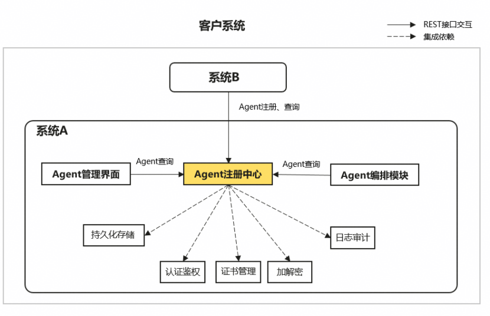

# MultiAgentFramework-A2A-T

A2A-T多智能体框架开源项目

## 交付形式
1. 首次开源仅交付源码（托管在github），不提供安装包，交付内容不包括构建工程

## 功能说明
1. 本项目提供Agent注册中心模块供客户系统集成，用于管理客户系统内部Agent，提供Agent注册、Agent查询能力。
2. 默认所注册的Agent会作为公共资源，暂无Agent所有者设计。
3. 本项目仅用作功能模块，非完整系统，模块自身不提供登录认证、鉴权、用户管理、日志审计、加解密、证书管理、密钥管理、数据库等能力，需由客户系统提供如上安全基础设施；源码中已预留相关方法函数，供二次定制实现。


## 设计约束
1. 本项目需要运行在linux系统上，支持ipv4环境
2. 当前支持单实例部署，仅用于内部系统，不可开放到公网，不可作为云服务部署，否则目标系统需同步提供防火墙、提供web服务器实现认证鉴权等安全能力
3. 向本项目注册的AgentCard不可含有个人数据例如电话号码，不可含有敏感信息例如密码、凭据，否则有信息泄露风险

## 启动前配置
### 证书配置（必选）
目标系统需提供一套完整证书用于启动端口，后续接收REST请求时会建立TLS传输通道，并根据配置校验对端证书。
配置文件：{安装目录}/etc/conf/server.conf
默认配置如下，可按需修改：
ip=127.0.0.1 
port=5000
ssl_certfile=etc/ssl/service/server.cer
ssl_keyfile=etc/ssl/service/server_key.pem
ssl_keyfile_password=etc/ssl/service/cert_pwd
ssl_ca_certs=etc/ssl/service/trust.cer
ssl_crl_file=etc/ssl/service/revocationlist.crl
ssl_verify_client=true

证书要求：
server.cer：必选，身份证书，仅支持pem编码格式
证书格式：X.509v3
证书密钥算法、密钥长度：RSA(≥3072 bits)，ECDSA(≥256 bits)
有效期：当前时间有效

cert_pwd：必选，私钥口令，文件名固定无后缀
内容要求为密文
口令原始明文复杂度需满足要求：至少8个字符，至少包含两种字符（数字、大写字母、小写字母、特殊字符`~!@# $%^& *()-_=+ |[{}];:'",<.>/? 和空格）
口令原始明文需与server_key.pem匹配

server_key.pem：必选，私钥文件，仅支持pem编码格式
私钥与公钥的匹配性：需要与server.cer中的公钥是匹配的

trust.cer：默认必选，Agent注册方的信任证书，仅支持pem编码格式，仅支持.cer文件，文件名固定，如果涉及多本证书，需合成一本
启动配置项ssl_verify_client=true时，必须存在
校验证书格式：X.509v3
校验有效期：当前时间有效
密钥算法、长度：RSA(≥3072 bits)，ECDSA(≥256 bits)

revocationlist.crl：可选，吊销列表，仅支持pem编码格式，仅支持.crl文件，如果涉及多本证书，需合成一本，可以不存在
校验证书格式：X.509v2
校验有效期：当前时间有效

不支持国密证书

证书权限要求：
客户配置修改证书路径后，需保证证书文件及所在目录的权限最小化，同时保证本项目进程拥有读取权限

证书变更后，需重启进程生效

本项目仅读取使用这些证书，不提供证书管理能力，例如证书过期告警、备份恢复等。


## 🚀 启动项目

请按照以下步骤启动项目：

1. **进入项目目录下的 `bin` 文件夹**  
   ```bash
   cd /yourPath/agent-registry/bin
   ```

2. **创建并激活虚拟环境**  
  先创建一个项目所需的虚拟环境，（python版本要求>=3.10）比如：使用 `conda` 创建名为 `agent_registry` 的虚拟环境（如尚未创建）：
   ```bash
   conda create -n agent_registry python=3.1x
   ```
   激活虚拟环境：
   ```bash
   conda activate agent_registry
   ```

3. **安装依赖包**  
   安装项目所需的 Python 依赖：
   ```bash
   pip install -r ../requirements.txt
   ```

4. **启动项目**  
   执行启动脚本以运行项目：
   ```bash
   ./start.sh
   ```

5. **审计日志**
   日志记录：log/audit/audit.log
   日志配置：etc/conf/log_config.conf，可配置文件个数及文件大小

6. **运行日志**

# 注册中心