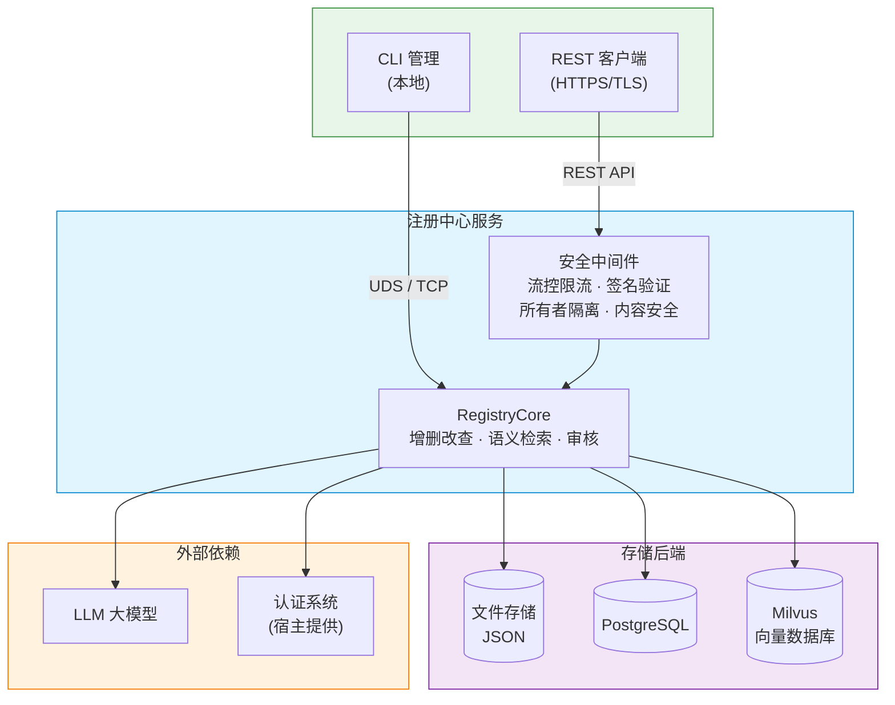

<!--
Copyright (c) 2026 Huawei Technologies Co., Ltd.
All Rights Reserved.

SPDX-License-Identifier: Apache-2.0

   Licensed under the Apache License, Version 2.0 (the "License"); you may
   not use this file except in compliance with the License. You may obtain
   a copy of the License at

        http://www.apache.org/licenses/LICENSE-2.0

   Unless required by applicable law or agreed to in writing, software
   distributed under the License is distributed on an "AS IS" BASIS, WITHOUT
   WARRANTIES OR CONDITIONS OF ANY KIND, either express or implied. See the
   License for the specific language governing permissions and limitations
   under the License.
-->

# A2A-T AgentCard 注册中心

<p align="center">
  <a href="https://www.python.org/"></a>
  <a href="LICENSE"></a>
</p>

<p align="center">
  <strong>面向 A2A-T 生态的多厂商智能体 AgentCard 统一注册与管理服务。</strong>
  <br>
  A centralized registry for managing AgentCards across multi-vendor AI agents in the A2A-T ecosystem.
</p>

<p align="center">
  <a href="./README.md">English</a>
</p>

---

## 概述

注册中心是 A2A-T 协议生态中的 AgentCard 统一管理服务，支持将不同厂商的 AI Agent 进行集中注册、发现与管控，实现多源智能体的可控接入与维护。

**典型场景：** 运营商管理 RAN 节能优化 Agent，企业平台编排多厂商 AI 服务，内部系统的 Agent 注册审核流程。


## 特性

| 分类 | 能力 |
|------|------|
| **AgentCard 管理** | 注册、查询（按名称/组织）、更新、注销 Agent 描述信息 |
| **语义检索** | 基于 LLM + 可选向量数据库（Milvus）的自然语言任务匹配 |
| **审核流程** | 可选的人工审核机制——Agent 注册后状态为 `registered`，管理员审批后变为 `published` |
| **标签管理** | 独立的标签实体，支持完整 CRUD，可分配给 Agent |
| **TLS 安全通信** | TLS 1.2/1.3，强密码套件，支持双向 TLS 客户端证书校验 |
| **签名验证** | 基于 JWS 的 AgentCard 完整性校验（RS256、ES256），支持静态 JWK 文件和动态 `jku` 查询 |
| **所有者隔离** | 基于 TLS 客户端证书 CN 的 Agent 操作隔离，支持严格/宽松两种模式 |
| **内容安全** | Prompt 注入关键词和高危 Skill 描述的黑名单过滤（默认启用，不可关闭） |
| **流控限流** | 按接口粒度的速率限制（可配置：10–100 次/秒）和并发控制 |
| **日志审计** | 滚动 JSON 格式审计日志，记录操作六要素（时间、客户端IP、用户、操作、对象、结果） |
| **CLI 管理** | 交互式命令行工具，支持 Agent 审批、标签管理、全量 Agent 查询 |
| **自定义扩展** | 可插拔的处理器（认证、审计、解密、存储）和大模型（LLM）提供者 |

## 快速开始

### 环境要求
- **Python** 3.10+
- **操作系统**：生产环境需 Linux；Windows 仅支持开发调试

### 安装运行

```bash
# 克隆仓库
git clone https://gitcode.com/OpenAN/registry-center.git
cd registry-center

# 创建并激活虚拟环境
python3 -m venv .venv
source .venv/bin/activate      # Linux
# .venv\Scripts\activate       # Windows

# 安装依赖
pip install -r requirements.txt

# 交互式配置向导（证书、存储、安全选项）
python -m agent_registry.init

# 启动服务
python -m agent_registry.start
```

服务默认监听 `https://127.0.0.1:5000`。快速测试可关闭 HTTPS：

```bash
python -m agent_registry.init    # 选择 enable_https = false
python -m agent_registry.start   # 启动在 http://127.0.0.1:5000
```

### 注册第一个 Agent

```bash
curl -X POST http://127.0.0.1:5000/rest/v1/registry-center/agent-cards \
  -H "Content-Type: application/json" \
  -d '{
    "agentCards": [{
      "name": "My Agent",
      "description": "一个示例 Agent。",
      "version": "1.0.0",
      "provider": {"organization": "MyOrg", "url": "https://example.com"},
      "capabilities": {"streaming": true, "pushNotifications": false},
      "skills": [{
        "id": "example-skill",
        "name": "示例技能",
        "description": "演示基本的 Agent 注册流程。"
      }],
      "supportedInterfaces": [{
        "url": "http://127.0.0.1:8080/",
        "protocolBinding": "HTTP+JSON",
        "protocolVersion": "1.0.0"
      }]
    }]
  }'
```

## 架构



## API 概览

| 方法 | 端点 | 说明 |
|------|------|------|
| `POST` | `/rest/v1/registry-center/agent-cards` | 注册 AgentCard |
| `GET` | `/rest/v1/registry-center/agent-cards` | 查询 Agent 列表（可按名称/组织过滤） |
| `GET` | `/rest/v1/registry-center/agent-cards/{org}/{name}` | 查询指定 Agent 详情 |
| `PUT` | `/rest/v1/registry-center/agent-cards/{org}/{name}` | 更新指定 Agent |
| `DELETE` | `/rest/v1/registry-center/agent-cards/{org}/{name}` | 注销指定 Agent |
| `POST` | `/rest/v1/registry-center/agent-cards/semantic-query` | 按任务描述语义检索 Agent |
| `GET` | `/rest/v1/registry-center/keys` | 获取注册中心验签公钥（JWK Set） |

完整接口规范、请求/响应示例、错误码说明请参阅 [API 参考](docs/zh/注册中心API参考.md)。

## 配置速查

| 配置文件 | 用途 |
|----------|------|
| `etc/conf/server.conf` | 服务 IP、端口、TLS 证书、签名验证、审核开关、所有者隔离 |
| `etc/conf/server.properties` | TLS 协议版本、密码套件、连接/超时/流控参数 |
| `etc/conf/persistence.conf` | 存储后端：`file`（默认）、`postgresql`、`sqlite` |
| `etc/conf/log_config.conf` | 审计日志轮转参数（文件大小、备份数量） |
| `common/config/llm_config.json` | 语义检索的 LLM 模型端点（兼容 OpenAI 格式或 AOC 平台） |

交互式配置：

```bash
python -m agent_registry.init
```

## CLI 管理

启动交互式命令行：
```bash
python -m agent_registry.cli
```

主要命令：

```bash
# Agent 管理
agent-registry> agent list                        # 查询全量 Agent
agent-registry> agent get -o MyOrg -n "My Agent"  # 查询 Agent 详情
agent-registry> agent approval -o MyOrg -n "My Agent"  # 审核 Agent
agent-registry> agent set-tags -o MyOrg -n "My Agent" -t tag1,tag2  # 设置标签

# 标签管理
agent-registry> tag create --name mytag           # 创建标签
agent-registry> tag list                          # 查看所有标签
agent-registry> tag update --id <uuid> --name newname  # 更新标签
agent-registry> tag delete --id <uuid>            # 删除标签
```

## 文档导航

| 文档 | 说明 |
|------|------|
| [用户指南](docs/zh/注册中心用户指南.md) | 特性介绍、安装部署、CLI 使用、接口能力、FAQ |
| [开发指南](docs/zh/注册中心开发指南.md) | 系统架构、Agent 注册流程、语义检索、自定义 LLM/处理器扩展 |
| [API 参考](docs/zh/注册中心API参考.md) | 完整 REST 接口规范，含请求参数、响应格式、状态码 |
| [安全能力指南](docs/zh/注册中心安全能力指南.md) | TLS 通信、访问控制、日志审计、内容安全、证书工具 |
| [GCP 容器化部署指南](docs/zh/注册中心GCP容器化部署指南.md) | 在 Google Cloud Platform 上容器化部署注册中心 |
| [LLM 配置说明](common/config/README_zh.md) | LLM 配置文件字段说明与示例 |

## 部署说明

本项目仅交付源码，使用者需自行完成：

1. **构建安装**：在 Linux 服务器上安装依赖
2. **准备证书**：或使用 `python generate_selfsign_cert.py <目录> serverAuth` 生成调试用自签名证书
3. **交互式配置**：`python -m agent_registry.init`
4. **集成安全基础设施**：客户系统需提供认证、鉴权、用户管理、加解密、数据库等能力
5. **权限最小化**：文件权限 `400`，目录权限 `700`，可执行 `.sh` 文件 `500`

> **注意：** 本模块用于内部系统集成，不可直接开放到公网，如需公网部署需同步提供防火墙、WAF、Web 认证等安全能力。

## 设计约束

- 单实例部署，非分布式架构
- 生产环境必须运行在 Linux 上，Windows 仅限开发调试
- Agent 注册数量上限默认 100 个（可通过 `agent.num.max` 配置）
- 请求体大小限制 1 MB
- AgentCard 不可包含个人数据（如电话号码）或敏感信息（如密码、凭据）

## 许可证

本项目基于 **Apache License 2.0** 开源协议。详见 [LICENSE](LICENSE)。
